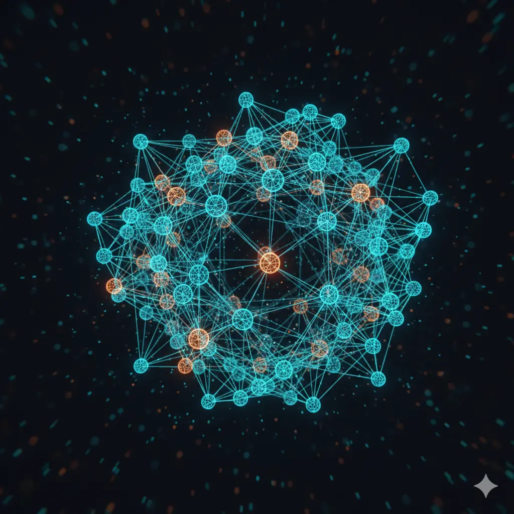

# Teorie Grafů

Grafová teorie je fascinující oblastí informatiky a matematiky, která se zabývá studiem grafů – struktur používaných k modelování párových vztahů mezi objekty. Grafy najdeme všude kolem nás: od sociálních sítí, přes navigační systémy (mapy), až po strukturu webu nebo elektrické obvody.

## Obsah kurzu

Tento materiál je rozdělen do následujících kapitol:

### 1. [Úvod do teorie grafů](docs/01-uvod.md)
*   Co je to graf (vrcholy, hrany).
*   Historie (Sedm mostů města Královec).
*   Základní terminologie (stupeň vrcholu, cesta, cyklus).

### 2. [Vlastnosti grafů](docs/02-vlastnosti-grafu.md)
*   Orientované vs. neorientované grafy.
*   Ohodnocené grafy (vážené hrany).
*   Souvislost grafu, komponenty souvislosti.
*   Stromy a lesy.

### 3. [Reprezentace grafů v počítači](docs/03-reprezentace.md)
*   Jak uložit graf do paměti.
*   Matice sousednosti (Adjacency Matrix).
*   Seznam sousedů (Adjacency List).
*   Seznam hran (Edge List).
*   Výhody a nevýhody jednotlivých přístupů (paměťová a časová složitost).

### 4. [Základní grafové algoritmy](docs/04-zakladni-algoritmy.md)
*   Prohledávání do šířky (BFS - Breadth-First Search).
*   Prohledávání do hloubky (DFS - Depth-First Search).
*   Nejkratší cesta v grafu (Dijkstrův algoritmus).

### 5. [Aplikace a historie: Mosty města Královce](docs/05-mosty.md)
*   Problém 7 mostů města Královce (Königsberg).
*   Eulerovo řešení a abstrakce.
*   Eulerovské grafy (tah a kruh).
