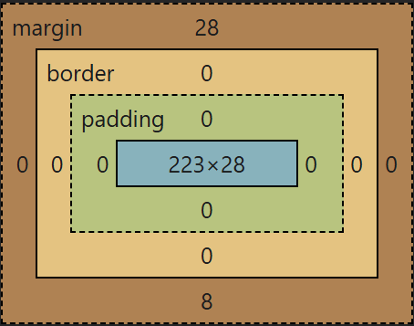

# 02. Box Model, barvy a jednotky

Znalost samotné syntaxe sice kód rozběhne, ale neřekne vám nic o tom, jak se věci na monitoru reálně chovají. V této kapitole pochopíte druhou nejdůležitější věc celého frontendu – jak si prohlížeč vykládá prostor, ve kterém kreslí krabice (strom tagů).

## Barvy na webu

CSS nám dává obrovskou svobodu v tom, jak definovat barvy (ať už textu přes vlastnost `color` nebo pozadí přes `background-color`). Můžeme použít:

1. **Pojmenované barvy (Klíčová slova):** `red`, `blue`, `transparent` (dobré pro rychlé testování, na skutečném webu se nepoužijí).
2. **Kódování HEX (Hexadecimální soustava):** `#ff0000` (červená), `#ffffff` (bílá) atd. Nejpoužívanější historický formát. Dá se zkrátit i na 3 znaky (např. `#f00`).
3. **Funkce RGB:** `rgb(255, 0, 0)` (Tři čísla od nescházejí černé nuly po maximální 255. Červená, žlutá, modrá).
4. **Funkce RGBA (A = Alpha kanál/Průhlednost):** `rgba(255, 0, 0, 0.5)` kde s tím čtvrtým zápisem z jedničky tvoříme poloprůhlednou 50% barvu pozadí.
5. **Moderní CSS fce HSL:** `hsl(0, 100%, 50%)` definuje odstín, sytost a světlost. Tento formát designéři v CSS3 milují.

## Jednotky a měření délek

V čem ale na webu určujeme samotný rozměr textu nebo tloušťku rámečku? Ne všichni sedí u metrového monitoru...

### Absolutní jednotka (Pixel)
- `px` (Pixel). Fixní bodový rozměr obrazovky. Pokud tlačítku nastavíte šířku 200px, bude mít vždy 200 pixelů na obrazovce mobilu i ve 4K televizi. Což je právě hlavní kámen úrazu pevných šířek dnešních grafických mobilních designů.

### Relativní (Pružinovité) jednotky
- `%` (Procenta). Nejmocnější společník. Pokud zadáte šířku okýnka `width: 50%`, sebere si z velikosti obrazovky (přesněji nejbližšího ohraničeného rodiče) polovičku prostoru a nehledě na zařízení se mu vždy plynule matematicky přizpůsobí.
- `rem` a `em` (Relativní typografické fonty). Týká se hlavně písma `font-size`. Zatímco staré řešení `24px` by bylo pro slabozrakého s 200% lupou prohlížeči ignorováno, zápis `1.5rem` reaguje plynule na měřítka stroje – Jedna jednotka (rem) se odvíjí od základu hlavní stránky vašeho stroje.
- `vw` (Viewport width) / `vh` (Viewport height). Obdoba k %, ale ignorující ohraničení na stránce a stahující absolutně celých „100 vw“ jen od okrajů rolované tabulky (okna prohlížeče). Skvělé k nakódování celoplošných filmových plakátů `height: 100vh;`.

---

## CSS Box Model (Nejdůležitější tajemství layoutu)

Všechno na webu je pravoúhlá **KRABICE (Box)**. Dokonce i vajíčko, nadpis i vodorovná čára. Prohlížeč kolem každého tohoto obdélníku/krabice počítá 4 základní vrstvy:



1. **Obsah (`content`)**: Velikost samotného plátna. Sem zadáváte např. text nebo rozměry vlastností `width` a `height`.
2. **Vnitřní ochrana (`padding`)**: Prostor mezi obrazem a ochranným rámem. Pokud tlačítku zapíšeme vnitřní plnění `padding: 20px`, vznikne uvnitř textu před okrajem zleva doprava bezpečně tlustý chráněný vzduch – ideální ke vzniku obrovských klikacích ploch.
3. **Rámeček (`border`)**: Samotný dřevěný rám obkreslující plátno. Například `border: 2px solid black`.
4. **Vnější prostor (`margin`)**: Vzduch k sousedním sousedním dílům/muzeálním obrazům. Pokud dáte 2 odstavce nad sebe, díky svému `margin-bottom` se nebudou navzájem dotýkat rámů, ale odpuzují se 16 pixely prázdného místa od sebe na novou vizuální řádku.


### Zabiják jménem Výpočet šířky Boxu
Zřejmě nejčastější noční můra u zrodu starého CSS se schovává pod kapotou z defaultu takzvaného `content-box` modelu. 
Pokud vytvoříte Div tlačítko se specifickou šířkou pro display přesně **500 pixelů**: `width: 500px` a budete jej chtít lehce obalit a přibarvit. Dáte mu tedy třeba o stěnu menší vnitřní ochranu `padding: 20px` a tenký obvodový rámeček `border: 5px solid red`.

Místo toho, aby měl prvek 500 pixelů jako jste chtěli nakreslit, vyhodí vám na monitoru ve výpočtu reálně krabici obří šířky krásných **550 pixelů**. Přidáním padding a okrajů totiž defaultně prohlížeče zvětšují matematické celko-hrany `(500 vlastní obsah + 20px zleva / 20 px padding zprava a  5px dvakrát rám)`. To znamená, že roztříští vaše zarovnání podílů prvků stránky klidně do tří dalších rohů a rozpadne se kostra webařům před očima.

**A Zde tkví záchrana webu!**
Pamatujte, téměř první pravidlo na samotném nultém řádku celého hlavního archivu u profesionálů tak bývá takzvaná CSS omluvenka za tyhle problémy s matematickou kostkou: Reset Box-Sizingu.

```css
* {
   box-sizing: border-box;
}
```
Značkou hvězdičky si nadosmrti řeknete (kompletně celý strom stránek DOM!), že pokud na vás kdokoli použije `width: 500px`. Zabráníte tomu nabubřelému zvětšení krabice do světa. Jakýkoliv přidaný rámeček na 5px a ochranná výstelka 20px uvnitř, místo roztáhnutí obrysové kostky **ubere místo samotnému vnitřnímu obrazu / textu**! Text tedy ve výsledku pro sebe bude mít k vykreslení logicky místo pouhých `450px`, ale tlačítko si udrží svých `500px` zvenčí ke zdi s bráškou.

---

> [!TIP]
> **Praktické procvičení z kompetencí**
> Napiš CSS pravidlo pro vytipovanou třídu `.karta`, která bude mít: tmavě šedé pozadí, bílou barvu pro texty, vnitřní odsazení plátna k textům 15px (ideální bezpečí čitelnosti) a populární zaoblené rohy u rámečků na 10px.
> 
> *Řešení:*
> ```css
> .karta {
>    background-color: #333; 
>    color: white;
>    padding: 15px; 
>    border-radius: 10px;
> }
> ```
